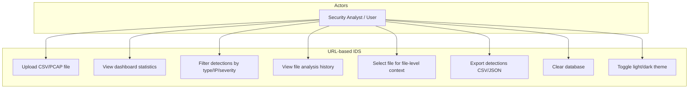
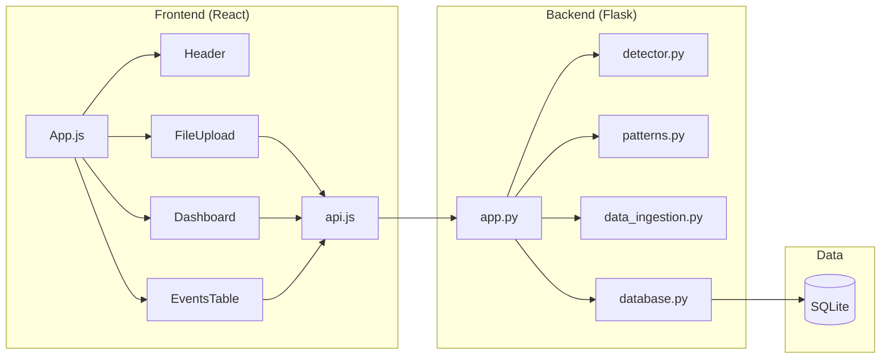
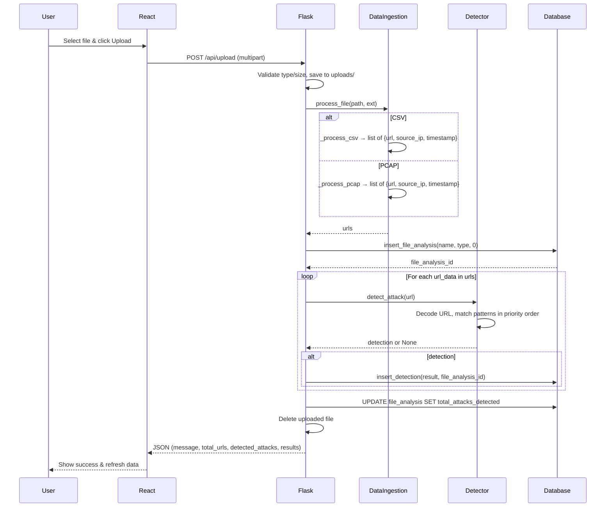
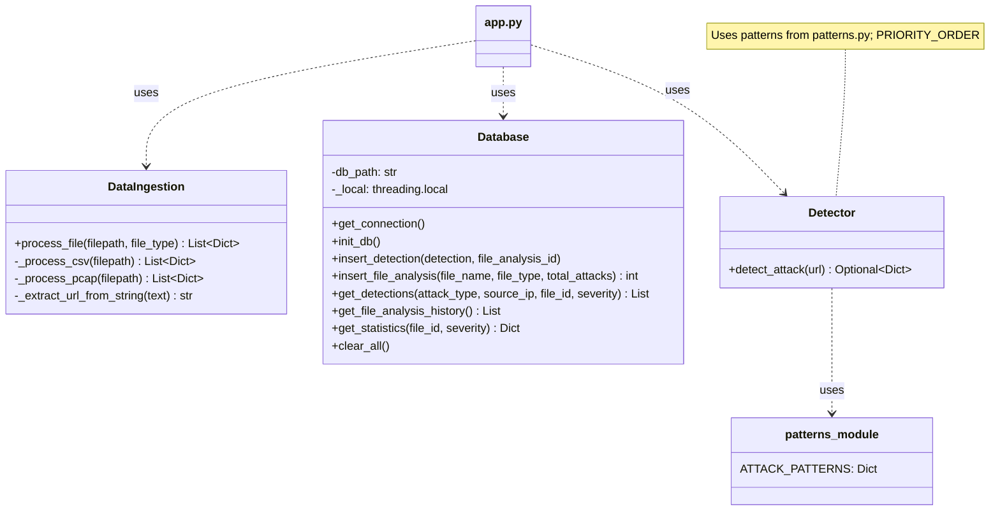
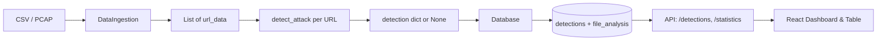

# URL-based Intrusion Detection System — Project Documentation

**Author:** Vansh Shah  
**Roll No.:** MCA2547  
**Mentor:** Prof. Puja Devgun  
**Academic Project — Semester 1**

---

## Table of Contents

| Section | Topic | Pages |
|--------|--------|-------|
| 1 | Scope of Project | 7–8 |
| 2 | Project Description & Limitations | 9–10 |
| 3 | UML Diagrams | 11–13 |
| 4 | Database | 14–16 |
| 5 | Screen Shots | 17–20 |
| 6 | Conclusion | 21–22 |
| 7 | Bibliography | — |

---

# 1. Scope of Project (Pages 7–8)

## 1.1 Introduction to Scope

The **URL-based Intrusion Detection System (URL-IDS)** is a full-stack web application designed for **offline, rule-based analysis** of web traffic to detect malicious or suspicious URLs. The scope is explicitly bounded to **file-based analysis**: the system accepts **CSV log files** and **PCAP network capture files**, extracts URLs (and related metadata such as source IP and timestamp), and runs each URL through a **priority-based, pattern-matching detector**. Results are stored in a local database and presented through an interactive **React.js dashboard** with charts, filters, and export options.

## 1.2 In-Scope Features

- **Multi-format input**
  - **CSV:** Log files with URL, source IP, and timestamp columns (flexible column-name mapping).
  - **PCAP:** Network captures; HTTP request lines are parsed to extract URL, source IP, and packet timestamp.
- **Attack detection (one result per URL)**
  - **Command Injection** (High severity): shell commands, command chaining (`;`, `&&`, `||`), backtick substitution, `$(...)`.
  - **Directory Traversal** (Medium): `../`, `..\`, encoded variants, paths like `/etc/passwd`, `/etc/shadow`.
  - **Cross-Site Scripting (XSS)** (High): `<script>`, `javascript:`, event handlers (`onerror`, `onload`, etc.), `alert(`, `document.cookie`, `<iframe>`, `<svg onload`, etc.
  - **SQL Injection** (High): classic payloads such as `OR 1=1`, `UNION SELECT`, `--`, `DROP TABLE`, etc.
  - **Suspicious Activity** (Low): weak indicators (e.g. single quote, SQL keywords alone) when no higher-priority match is found.
- **Priority-based, single classification per URL:** For each URL, at most one attack type is reported; order is Command Injection → Directory Traversal → XSS → SQL Injection → Low severity.
- **URL decoding:** Percent-encoded URLs are decoded (multiple passes, limited) before pattern matching.
- **Confidence score:** A 0–100 score is computed from number of matched indicators and optional encoding bonus.
- **Backend API (Flask)**
  - Health check, file upload & analyze, list detections (with filters), statistics, top IPs, file history, clear database, export CSV/JSON.
- **Frontend (React)**
  - File upload with success/error feedback.
  - Dashboard: summary stats, pie chart (attack types), bar charts (severity, top IPs), analyst summary with recommendations.
  - File-based context: select a file from history to view stats/detections for that file only.
  - Events table with sortable columns and filters (attack type, source IP, severity).
  - Export filtered detections as CSV or JSON.
  - Light/dark theme with session persistence.
- **Database (SQLite):** Persist detections and file analysis history; support filtering and statistics by file and severity.
- **Security and operations**
  - Uploaded files are processed and then **deleted** from disk.
  - File size limit (e.g. 16 MB) to avoid resource exhaustion.
  - Allowed file types restricted to `.csv` and `.pcap`.

## 1.3 Out-of-Scope (Explicit Limitations)

- **Real-time monitoring:** The system does **not** monitor live traffic; it only processes uploaded files.
- **Packet-level deep inspection:** PCAP processing is limited to extracting HTTP request lines from TCP payloads; no full HTTP parsing, TLS decryption, or non-HTTP protocols.
- **Machine learning / behavioral analysis:** Detection is purely **regex/rule-based**; no ML models or anomaly detection.
- **Authentication/authorization:** No user login or role-based access; the UI and API are open to whoever can reach the server.
- **Multi-tenancy or distributed deployment:** Single backend instance and single SQLite database; no clustering or multi-user isolation.
- **Blocking or remediation:** The system **detects and reports** only; it does not block requests, modify firewalls, or integrate with WAF/IPS for automatic response.
- **Other attack categories:** Only the listed attack types (and low-severity “Suspicious Activity”) are in scope; e.g. SSRF, XXE, LDAP injection are not implemented as first-class types in the current detector (though the README may list them as possible extensions).

## 1.4 Target Users and Use Cases

- **Security analysts / SOC:** Review logs or captures offline, see which URLs triggered which rules, and export results for reports or SIEM ingestion.
- **Academic / learning:** Demonstrate URL-based IDS concepts, regex-based signatures, and a simple full-stack architecture (Flask + React + SQLite).
- **Extension baseline:** The codebase is structured so that real-time IDS, SIEM integration, or new attack patterns can be added without rewriting the core (see extension notes in `app.py`, `detector.py`, `patterns.py`).

## 1.5 Technology Stack Summary

| Layer | Technology |
|-------|------------|
| Backend | Python 3.x, Flask, Flask-CORS |
| Detection | Custom module (`detector.py`) using regex patterns from `patterns.py` |
| Data ingestion | Pandas (CSV), Scapy (PCAP) |
| Database | SQLite (`database.py`) |
| Frontend | React 18, Chart.js / react-chartjs-2, Axios |
| Deployment (optional) | Gunicorn (backend), static build for frontend |

---

# 2. Project Description & Limitations (Pages 9–10)

## 2.1 Project Description

The project implements an **URL-based Intrusion Detection System** that:

1. **Accepts** CSV or PCAP files via a web UI.
2. **Extracts** URLs (and, where available, source IP and timestamp) from those files.
3. **Analyzes** each URL using a **priority-ordered set of regex-based attack patterns** (command injection, directory traversal, XSS, SQL injection, and low-severity suspicious indicators).
4. **Assigns** at most one attack type per URL, with a severity (High/Medium/Low) and an optional confidence score (0–100).
5. **Stores** results in SQLite (detections plus file analysis metadata).
6. **Presents** results in a React dashboard: summary statistics, charts (by attack type, severity, top IPs), analyst summary with recommendations, file history with file-level context, and a filterable/sortable events table.
7. **Allows** export of detections (and overall statistics) as CSV or JSON, and clearing of the database.

The architecture is **modular**: detection rules live in `patterns.py`, detection logic in `detector.py`, ingestion in `data_ingestion.py`, persistence in `database.py`, and API in `app.py`. The frontend calls the backend REST API and renders components (Header, FileUpload, Dashboard, EventsTable) with a theme-aware, SOC-style UI.

## 2.2 Functional Description by Component

- **Backend – `app.py`:** Flask app with CORS; routes for health, upload, detections (with optional filters), statistics, top-ips, file-history, clear-database, export CSV/JSON. Upload validates file type and size, saves temporarily, runs ingestion and detection, writes to DB, then deletes the file.
- **Backend – `detector.py`:** `detect_attack(url)` decodes the URL, then checks patterns in priority order; returns one detection dict (attack_type, severity, confidence_score) or None.
- **Backend – `patterns.py`:** Dictionary of compiled regex lists per attack key (command_injection, directory_traversal, xss, sql_injection, low_severity).
- **Backend – `data_ingestion.py`:** `DataIngestion.process_file(filepath, file_type)` dispatches to `_process_csv` or `_process_pcap`; returns list of `{url, source_ip, timestamp}`. CSV uses Pandas and flexible column mapping; PCAP uses Scapy and raw HTTP line parsing.
- **Backend – `database.py`:** SQLite with `detections` and `file_analysis` tables; thread-local connections; methods for insert_detection, insert_file_analysis, get_detections (with filters), get_statistics, get_file_analysis_history, clear_all.
- **Frontend – `App.js`:** State for detections, statistics, file history, loading, connection error, filters, selectedFileId, theme; loads data (detections, stats, history) with current filters/file selection; handles theme toggle, file upload callback, filter changes, clear database.
- **Frontend – Dashboard:** Renders summary stats, pie chart (attack types), bar charts (severity, top IPs), analyst summary/recommendations, download overall CSV/JSON, file history table with selectable rows for file-level context.
- **Frontend – FileUpload:** File input and upload button; on success shows “Uploaded: filename” and “Upload Another File”; displays success/error message.
- **Frontend – EventsTable:** Displays detections in a table with sortable columns (URL, source IP, attack type, severity, confidence, timestamp); filter dropdowns (attack type, source IP, severity); export CSV/JSON using current filters (and optional file_id).

## 2.3 Limitations (Detailed)

1. **Offline only:** No real-time capture or live traffic analysis; detection runs only on uploaded files.
2. **Rule-based only:** No ML or behavioral models; evasion via obfuscation or novel payloads may not be detected.
3. **One classification per URL:** A URL matching multiple categories is reported under the single highest-priority category only.
4. **CSV format dependency:** CSV must contain (or allow inference of) URL-like data; column names are heuristics (e.g. url, request, path; ip, source_ip; timestamp, time).
5. **PCAP limitations:** Only plain HTTP (no TLS decryption); URL extraction from first line of TCP payload; no handling of chunked encoding or multi-packet requests.
6. **False positives/negatives:** Regex rules can miss sophisticated encodings or produce false positives on benign but unusual URLs.
7. **No access control:** No login or permissions; anyone with network access can use the UI and API.
8. **Single-node:** One backend, one SQLite DB; no horizontal scaling or high-availability design.
9. **File size and type:** Only CSV and PCAP; max upload size (e.g. 16 MB) can be a limit for very large captures.
10. **No automatic response:** Detection and reporting only; no blocking, alerting, or SIEM push (though export and API are suitable for manual or future integration).

---

# 3. UML Diagrams (Pages 11–13)

## 3.1 Use Case Diagram

The following diagram summarizes actors and use cases.

**Use cases in text:**

- **Upload CSV/PCAP file:** User selects a file; system validates type/size, extracts URLs, runs detection, stores results, and shows success/error.
- **View dashboard statistics:** User sees total detections, attack types, severity breakdown, top IPs, and analyst summary.
- **Filter detections:** User filters by attack type, source IP, or severity (and optionally by file); table and stats update.
- **View file analysis history:** User sees list of previously analyzed files with upload time and attack count.
- **Select file for file-level context:** User clicks a file in history; dashboard and table show only that file’s data.
- **Export detections:** User exports current (filtered) detections or overall statistics as CSV or JSON.
- **Clear database:** User clears all detections and file history (with confirmation).
- **Toggle theme:** User switches between light and dark theme (persisted in session).

## 3.2 High-Level Architecture (Component Diagram)

## 3.3 Sequence Diagram: File Upload and Detection Flow

## 3.4 Class Diagram (Backend Core)

## 3.5 Data Flow (Detection Path)

---

# 4. Database (Pages 14–16)

## 4.1 Overview

The application uses **SQLite** as the persistence layer. The database stores:

1. **File analysis metadata:** Each uploaded file is recorded (name, type, upload time, total attacks detected).
2. **Detections:** Each detected malicious/suspicious URL is stored with URL, source IP, timestamp, attack type, severity, optional pattern_matched and confidence_score, and a foreign key to the file analysis record.

The database module uses **thread-local connections** so that Flask’s multi-threaded workers each have their own connection. The schema is created and migrated (e.g. adding `confidence_score`, `file_analysis_id` if missing) on `init_db()`.

## 4.2 Schema

### Table: `file_analysis`

| Column | Type | Description |
|--------|------|-------------|
| id | INTEGER PRIMARY KEY AUTOINCREMENT | Unique file analysis ID. |
| file_name | TEXT NOT NULL | Original filename (e.g. `logs.csv`). |
| file_type | TEXT NOT NULL | `csv` or `pcap`. |
| upload_time | TEXT NOT NULL | ISO timestamp (UTC) when the file was processed. |
| total_attacks_detected | INTEGER NOT NULL DEFAULT 0 | Number of detections linked to this file. |

### Table: `detections`

| Column | Type | Description |
|--------|------|-------------|
| id | INTEGER PRIMARY KEY AUTOINCREMENT | Unique detection ID. |
| file_analysis_id | INTEGER | FK to `file_analysis.id` (nullable for backward compatibility). |
| url | TEXT NOT NULL | The analyzed URL. |
| source_ip | TEXT | Source IP from log/packet (or `Unknown`). |
| timestamp | TEXT | Timestamp from log/packet if available. |
| attack_type | TEXT NOT NULL | e.g. Command Injection, XSS, SQL Injection. |
| severity | TEXT NOT NULL | High, Medium, or Low. |
| pattern_matched | TEXT | Optional; reserved for which pattern matched. |
| confidence_score | INTEGER | 0–100 optional confidence. |
| detected_at | TEXT DEFAULT CURRENT_TIMESTAMP | When the record was inserted. |

**Relationship:** Many `detections` can reference one `file_analysis` via `file_analysis_id`. Filtering by `file_id` in the API corresponds to `WHERE file_analysis_id = ?`.

## 4.3 Key Operations

- **Insert file:** `insert_file_analysis(file_name, file_type, total_attacks)` → returns `id`; used to link subsequent detections.
- **Insert detection:** `insert_detection(detection_dict, file_analysis_id)`; detection dict contains url, source_ip, timestamp, attack_type, severity, optional pattern_matched and confidence_score.
- **Get detections:** `get_detections(attack_type, source_ip, file_id, severity)` — optional filters; results ordered by `detected_at DESC`.
- **Get statistics:** `get_statistics(file_id, severity)` — total count, counts by attack_type, by severity, top 10 source IPs (filtered by file_id/severity when provided).
- **File history:** `get_file_analysis_history()` — last 50 file analyses (id, file_name, file_type, upload_time, total_attacks_detected).
- **Clear all:** `clear_all()` — deletes all rows in `detections` and `file_analysis` and resets SQLite auto-increment sequences for both tables.

## 4.4 File Location and Concurrency

- The database file is **`detections.db`** in the backend working directory (e.g. `backend/detections.db`).
- Thread safety is achieved by using a separate connection per thread (threading.local); no connection pooling or multi-process considerations in the current design.

---

# 5. Screen Shots (Pages 17–20)

This section should be filled with **actual screenshots** from the running application. Below is a checklist and short description of what each screenshot should show. Replace the placeholders with real images (e.g. `screenshots/01-upload.png`).

## 5.1 Screenshot 1: Landing / Upload (Light Theme)

- **What to capture:** Full view of the app after opening (e.g. `http://localhost:3000`): header “URL-based Intrusion Detection System”, theme toggle, “Upload File for Analysis” card with file input and “Upload CSV / PCAP File” button, and empty or initial dashboard/table state.
- **Purpose:** Show the default layout and upload interface.
- **Placeholder:** *[Insert screenshot: Landing page – light theme]*

## 5.2 Screenshot 2: After Upload – Dashboard (Statistics & Charts)

- **What to capture:** After uploading a file (e.g. `test_data.csv`): Summary Statistics card (Total Detections, Attack Types, Unique Source IPs), “Detections by Attack Type” pie chart, “Detections by Severity” bar chart, and “Top Attacking IPs” bar chart (if any).
- **Purpose:** Demonstrate that statistics and charts update after analysis.
- **Placeholder:** *[Insert screenshot: Dashboard with statistics and charts]*

## 5.3 Screenshot 3: Events Table and Filters

- **What to capture:** “Detected Security Events” card with filter dropdowns (All Attack Types, All Source IPs, All Severities), table with columns: URL, Source IP, Attack Type, Severity, Confidence, Timestamp; a few rows of data visible; Export CSV / Export JSON buttons.
- **Purpose:** Show filtering and tabular view of detections.
- **Placeholder:** *[Insert screenshot: Events table with filters]*

## 5.4 Screenshot 4: File History and File-Level Context

- **What to capture:** “File Analysis History” table with at least one row (File Name, Type, Upload Time, Attacks Detected); optionally “Clear selection (show all files)” or a selected row highlighted; “Final Analysis Summary” card with summary text and recommendations.
- **Purpose:** Show file-based context and analyst summary.
- **Placeholder:** *[Insert screenshot: File history and analysis summary]*

## 5.5 Screenshot 5: Dark Theme

- **What to capture:** Same or similar view as Screenshot 1 or 2 but with dark theme active (header and cards in dark style, charts with dark-friendly colors).
- **Purpose:** Show theme toggle and accessibility/SOC-style dark mode.
- **Placeholder:** *[Insert screenshot: Dark theme view]*

## 5.6 Screenshot 6: Export / Download Area

- **What to capture:** “Download Overall Statistics” card with “Download as CSV” and “Download as JSON” buttons (and optionally a successful download or the Events table export buttons).
- **Purpose:** Document export functionality.
- **Placeholder:** *[Insert screenshot: Export options]*

**Instructions for taking screenshots:** Run backend (`python app.py` in `backend`) and frontend (`npm start` in `frontend`), perform the actions above, and save images into a `screenshots` folder (e.g. `screenshots/01-landing-light.png`, `02-dashboard.png`, …). Reference them in your final report or replace the placeholders in this document.

---

# 6. Conclusion (Pages 21–22)

## 6.1 Summary

The URL-based Intrusion Detection System project delivers a **working full-stack application** for offline analysis of web traffic stored in CSV and PCAP files. It demonstrates:

- **Clear scope:** File upload → URL extraction → rule-based detection → storage → visualization and export.
- **Structured backend:** Separation of ingestion (`data_ingestion.py`), detection (`detector.py`, `patterns.py`), and persistence (`database.py`) behind a single Flask API (`app.py`).
- **User-oriented frontend:** React dashboard with summary statistics, charts (attack types, severity, top IPs), analyst summary and recommendations, file-level context, filterable/sortable events table, and export (CSV/JSON) and theme support.

Detection is **intentionally** rule-based and priority-based (one result per URL), with support for confidence scores and severity. The system is suitable for **security analysts** performing offline log/capture review and for **academic** use as a base for extensions (e.g. real-time IDS, SIEM integration, or new attack patterns).

## 6.2 Achievements

- Multi-format input (CSV and PCAP) with flexible column mapping and HTTP line parsing.
- Multiple attack categories (Command Injection, Directory Traversal, XSS, SQL Injection, Suspicious Activity) with configurable priority.
- SQLite schema that supports file-level context and filtered statistics.
- REST API that supports filtering, statistics, file history, and export.
- Dashboard that provides both high-level metrics and actionable recommendations.
- Light/dark theme and session-persisted preference for better usability.

## 6.3 Future Work

- **Real-time IDS:** Integrate the same `detect_attack()` with a proxy or log tail to analyze live requests.
- **SIEM/export integration:** Push detections to syslog, Splunk, or other SIEMs; or enhance export formats.
- **Rule management:** Load patterns from config or external feed and support hot-reload.
- **Authentication:** Add user login and role-based access for multi-user deployments.
- **More attack types:** Implement first-class rules for SSRF, XXE, LDAP injection, etc., in `patterns.py` and `detector.py`.
- **Improved PCAP handling:** TLS decryption (if keys available), full HTTP parsing, and handling of fragmented requests.

---

# 7. Bibliography

1. **Flask.** *Flask Web Development Framework.* https://flask.palletsprojects.com/  
2. **React.** *React – A JavaScript library for building user interfaces.* https://react.dev/  
3. **OWASP.** *OWASP Top Ten / Testing Guides (e.g. SQL Injection, XSS, Command Injection).* https://owasp.org/  
4. **Pandas.** *pandas: powerful Python data analysis toolkit.* https://pandas.pydata.org/  
5. **Scapy.** *Scapy – Packet manipulation.* https://scapy.net/  
6. **SQLite.** *SQLite Documentation.* https://www.sqlite.org/docs.html  
7. **Chart.js.** *Chart.js – Simple yet flexible JavaScript charting.* https://www.chartjs.org/  
8. **Axios.** *Axios – Promise based HTTP client.* https://axios-http.com/  

---

*End of documentation. Replace screenshot placeholders in Section 5 with actual images when preparing the final report.*
